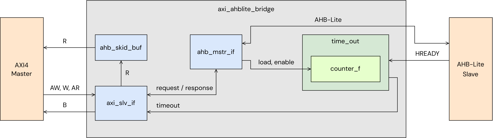

# AXI4 to AHB-Lite Bridge - RTL design review

Review of the synthesizable SystemVerilog translation of the AXI4 to AHB-Lite Bridge v3.0
reference design in this directory. Requirements are taken from PG177 and summarised in
[`00_doc/pg177_spec_review.md`](../../00_doc/pg177_spec_review.md). This document covers
the architecture, the microarchitecture of each block and the design findings.

## 1. Hierarchy

| Module | File | Function |
|---|---|---|
| `axi_ahblite_bridge` | `axi_ahblite_bridge.sv` | Top level: parameter guards, block interconnect. |
| `axi_slv_if` | `axi_slv_if.sv` | AXI4 slave: request capture, read/write arbitration, AXI write and read FSMs, B/R response generation, `WSTRB` size decode. |
| `ahb_mstr_if` | `ahb_mstr_if.sv` | AHB-Lite master: transfer FSM, `HTRANS`/`HBURST`/`HSIZE`/`HPROT`/`HMASTLOCK` generation, address generation, WRAP2 expansion, 1 KB split. |
| `time_out` | `time_out.sv` | Data-phase watchdog, generated only when `C_DPHASE_TIMEOUT != 0`. |
| `counter_f` | `counter_f.sv` | Loadable down counter with borrow output, used by `time_out`. |
| `ahb_skid_buf` | `ahb_skid_buf.sv` | Two-entry registered skid buffer on the AXI R channel. |

## 2. Parameters

| Parameter | Legal values | Effect |
|---|---|---|
| `C_S_AXI_DATA_WIDTH`, `C_M_AHB_DATA_WIDTH` | 32, 64; equal | Data path width. No width conversion. |
| `C_S_AXI_ADDR_WIDTH`, `C_M_AHB_ADDR_WIDTH` | 32-64; equal | Address passed through. |
| `C_S_AXI_ID_WIDTH` | 1-32 | AXI ID width. |
| `C_S_AXI_SUPPORTS_NARROW_BURST` | 0, 1 | Selects the address generator (Section 5.3). |
| `C_DPHASE_TIMEOUT` | 0, 16, 32, 64, 128, 256 | 0 removes the watchdog. |
| `C_FAMILY`, `C_INSTANCE` | - | Unused; kept for interface compatibility. |

Illegal combinations are rejected by `initial $fatal` blocks in generate branches of the top
level. These guards act in simulation only; synthesis does not enforce them.

## 3. Architecture

- **Clock and reset:** single clock `s_axi_aclk` for both interfaces; no CDC. One active-low
  synchronous reset `s_axi_aresetn` for both interfaces (`ahb_skid_buf` uses its inverted
  form).
- **Transaction model:** one transaction at a time. A new AW or AR is accepted only after
  the previous transaction has completed on AHB and returned its response. Completion is
  therefore always in order, and IDs are only captured and returned.
- **Data path:** AXI write data → `axi_wdata` (register) → `HWDATA` (register). `HRDATA` →
  `S_AXI_RDATA` (register) → skid buffer (register) → `s_axi_rdata`. No byte-lane steering;
  both buses use address-based little-endian lanes.
- **Interface timing:** every AHB output and every AXI output is driven from a register,
  except `BRESP`, which is decoded from registers. There is no combinational path from an
  input to an output.

## 4. AXI slave interface (`axi_slv_if`)

### 4.1 Request acceptance and arbitration

- A write starts when `AWVALID` or `WVALID` is high, no read is in progress, and `ARVALID`
  is low (or a write is pending). `AWREADY` and the first `WREADY` are asserted together,
  one clock after both `AWVALID` and `WVALID` are seen. AXI allows a slave to wait for both.
- A read is accepted when `ARVALID` is high and no write is in progress or pending.
  `ARREADY` is a registered single-cycle pulse.
- **Read priority:** when both directions request together, the read wins. If a write is
  waiting when a read completes (`RD_RESP` with `RREADY`), `write_pending` is set and the
  write takes the next turn. Neither direction can be starved.
- The request attributes (`AxADDR`, `AxLEN`, `AxSIZE`, `AxBURST`, `AxPROT`, `AxCACHE`,
  `AxLOCK`, `AxID`) are captured into shared registers at acceptance.

### 4.2 Write path

- FSM: `AXI_WR_IDLE → AXI_WVALIDS_WAIT → AXI_WRITING / AXI_WVALID_WAIT → AXI_WRITE_LAST →
  AXI_WR_RESP_WAIT / AXI_WR_RESP`.
- After the first beat, one W beat is accepted per completed AHB beat (`send_wvalid`), so
  `WREADY` paces the master to the AHB side.
- **Size decode for single writes** (`AWLEN = 0`): `HSIZE` is taken from `WSTRB` when it is
  one size-aligned run of lanes (byte, halfword, word, and doubleword on 64-bit); otherwise
  from `AWSIZE`. Bursts always use `AWSIZE`. `WSTRB` is not used for anything else.
- `BRESP` is returned after the data phase of the last AHB beat completes (non-posted).
  `BRESP[1] = wr_err_occured | timeout_inprogress`, where `wr_err_occured` is sticky over
  the whole burst; `BRESP[0]` is tied to 0.

### 4.3 Read path

- FSM: `AXI_RD_IDLE → AXI_READING / AXI_READ_LAST → AXI_WAIT_RREADY → RD_RESP`.
- Each completed AHB beat produces one R beat. `RRESP[1] = HRESP | timeout_inprogress`,
  sampled per beat; `RRESP[0]` is tied to 0. EXOKAY and DECERR cannot be generated.
- Backpressure: when the skid buffer is full, the AHB FSM holds the next beat
  (`AHB_RD_WAIT`), so `RREADY` low stalls the AHB burst with BUSY.

## 5. AHB-Lite master interface (`ahb_mstr_if`)

### 5.1 Transfer sequencing

- 15-state FSM handles single, burst, WRAP2, FIXED and 1 KB-split transfers for both
  directions. `HTRANS` is registered.
- No address pipelining: the next address phase is issued only after the current data
  phase completes. Between beats the FSM drives:
  - BUSY inside INCR/WRAP bursts (also while waiting for `WVALID` or `RREADY`);
  - IDLE between FIXED and WRAP2 transfers and before the NONSEQ that restarts a split
    burst.
- `HWDATA` is loaded when the address phase completes and is valid for the data phase.
- `HRESP` is sampled only when `HREADY` is high, i.e. in the second cycle of a two-cycle
  ERROR response. An ERROR does not change the FSM path: the remaining beats are issued.

### 5.2 Burst mapping

`HBURST` is decoded from `axi_burst`, `axi_length` and the 1 KB check:

| AXI | `HBURST` |
|---|---|
| INCR, `AxLEN = 0` | SINGLE |
| INCR, 4/8/16 beats, no 1 KB crossing | INCR4/8/16 |
| INCR, any other length, or crossing 1 KB | INCR |
| WRAP 4/8/16 | WRAP4/8/16 |
| WRAP 2, FIXED | SINGLE, with NONSEQ on every beat |

### 5.3 Address generation

One of four generate branches drives `HADDR` (32/64-bit × narrow off/on):

- **Narrow off:** start address aligned to the bus width; increment by the bus width.
- **Narrow on:** start address aligned to `axi_size`; increment by the transfer size.
- WRAP increments wrap inside `(AxLEN + 1) × size`. FIXED does not increment.

### 5.4 1 KB boundary split

- `axi_end_address = AxADDR[9:0] + AxLEN × size` (12 bits) flags a crossing at request
  time. This relies on AXI4 bursts never crossing 4 KB.
- `one_kb_cross` is raised when the current `HADDR` is the last transfer of a 1 KB region.
  After that beat the FSM drives IDLE, then NONSEQ for the next beat.
- The check is repeated on every beat, so a burst that crosses several boundaries
  (64-bit, 256 beats) restarts at each one.

### 5.5 Control signals

- `HSIZE`, `HBURST` and `HMASTLOCK` are registered from the captured request every clock;
  `HWRITE` and `HPROT` are loaded when a request starts. They change in the same clock as
  the first NONSEQ.
- `HPROT = {1'b0, AxCACHE[0] & ~AxCACHE[2] & ~AxCACHE[3], AxPROT[0], ~AxPROT[2]}`, reset
  value `4'b0011`.

## 6. Timeout watchdog (`time_out`, `counter_f`)

- The counter is loaded with `C_DPHASE_TIMEOUT − 1` at the start of every AHB address or
  data phase and counts down only while the bridge waits for `HREADY`. Stalls on the AXI
  side (`WVALID`, `RREADY`) are not counted.
- Borrow out of the counter, qualified by `~HREADY`, is registered as `timeout_o`, then as
  `timeout_inprogress` in `axi_slv_if`. Because of these registers the bridge terminates a
  read after `C_DPHASE_TIMEOUT + 2` wait cycles and a write after `C_DPHASE_TIMEOUT + 1`.
- While `timeout_inprogress` is set, `HTRANS` is forced to IDLE, the FSM steps through the
  remaining beats without AHB transfers, and every remaining response is SLVERR. The flag
  clears when neither direction is in progress.

## 7. Read-data skid buffer (`ahb_skid_buf`)

- Two-entry buffer with registered `VALID`/`READY` (duplicated registers marked `keep`) for
  timing isolation of `s_axi_rready`.
- `S_READY` is low during reset and rises one clock after reset is released.
- The `skid_stop` path and the `STRB`/`USER` fields are tied off at the top level and are
  unused.

## 8. Findings

| # | Type | Finding | Impact |
|---|---|---|---|
| 1 | Performance | At least two clocks per AHB beat (BUSY/IDLE after every beat), and one outstanding transaction. | AHB utilisation ≤ 50 %; no overlap between transactions. |
| 2 | Protocol | On timeout, `HTRANS` changes from BUSY to IDLE while `HREADY` is still low. IHI0033A allows BUSY to change only to SEQ during a wait state in a fixed-length burst. The slave's pending data phase is not terminated. | AHB bus state is undefined after a timeout; reset is required, as PG177 recommends. |
| 3 | Protocol | `HMASTLOCK` follows the captured `AxLOCK` and stays high during IDLE after a locked request until the next request. | Harmless on single-master AHB-Lite; can hold a multi-master interconnect locked. |
| 4 | Functional | Strobes: a zero or non-contiguous `WSTRB` on a single write, and every `WSTRB` in a burst, are ignored, so the whole `HSIZE`-wide word is written. With narrow off, a single write with a partial `WSTRB` gets a narrow `HSIZE` at a bus-aligned `HADDR`, so it writes lane 0 instead of the strobed lane. | Unsupported traffic per PG177; data in unstrobed lanes is overwritten. |
| 5 | Functional | Unaligned writes are aligned the same way as reads (Section 5.3); PG177 describes alignment only for reads. | Lanes below the start address are written. |
| 6 | Functional | `HPROT[2]` is set only for `AxCACHE = 00x1`; the bufferable encodings `0111`, `1011` and `1111` map to non-bufferable. | Conservative mapping. |
| 7 | Arbitration | `WVALID` alone, before `AWVALID`, starts the write FSM and blocks reads until the write completes. | Legal AXI; read latency grows with the AW delay. |
| 8 | Implementation | Parameter guards are simulation-only (`initial $fatal`). | Synthesis of an illegal configuration is not blocked. |
| 9 | Code quality | Dead logic: `axi_wlast` and `ahb_write_sm` are never read; the skid-buffer stop and `STRB`/`USER` paths and the up-count path of `counter_f` are unused; `C_FAMILY` and `C_INSTANCE` have no effect. Signal names are kept from the reference design, including misspellings (`write_statrted`, `wr_err_occured`). | Removed by synthesis; adds review noise only. |

Findings 3-5 reproduce the reference design and are kept unchanged.